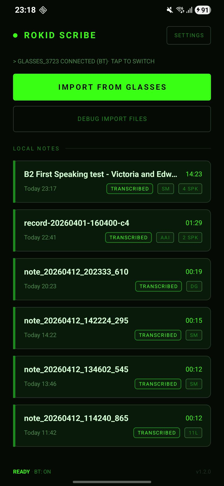
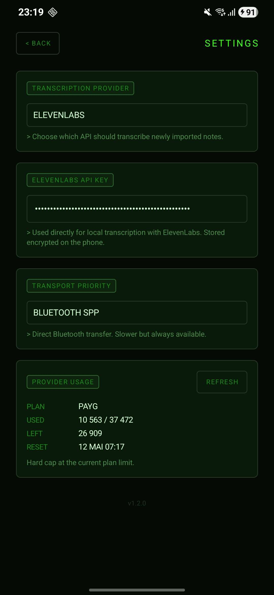
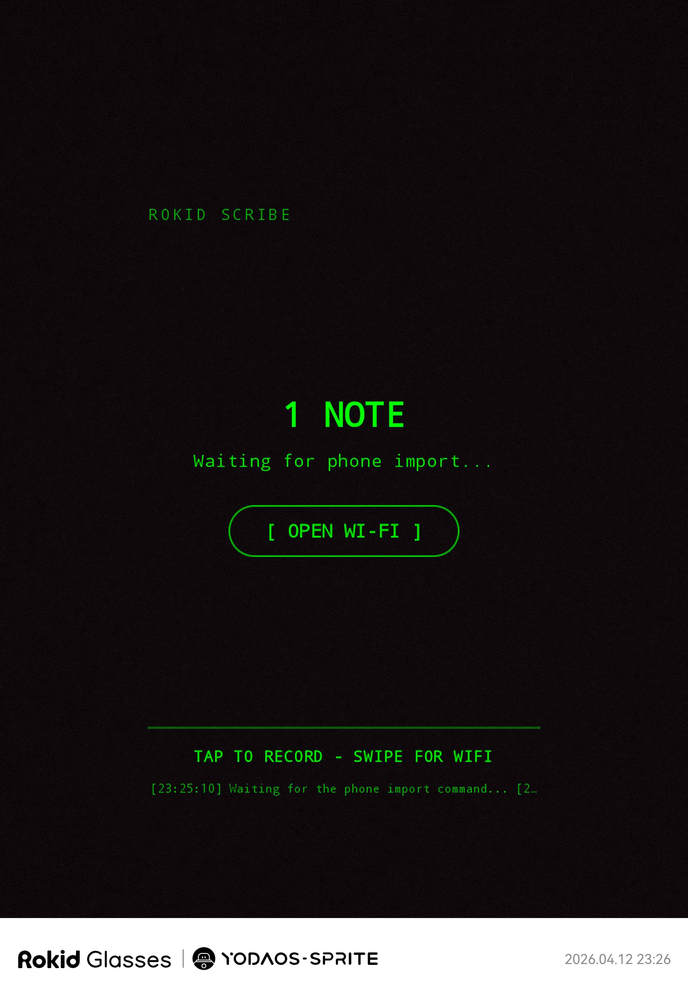
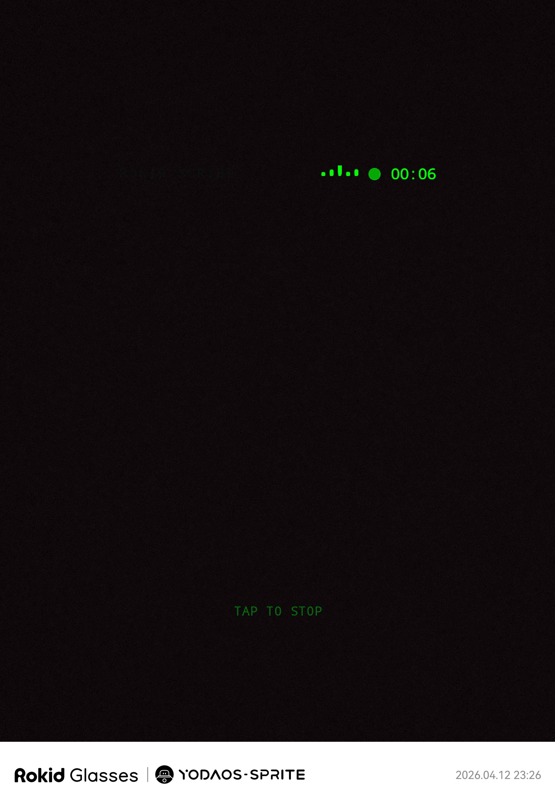

## Rokid-Scribe

<p align="center">
  
</p>

<p align="center">
  Capture voice notes on Rokid glasses, pull them from your phone over local transport, transcribe them on-device with multiple providers, and export the result as <code>txt</code> or <code>pdf</code>.
</p>

---

## Screenshots

<p align="center">
  
  &nbsp;&nbsp;&nbsp;&nbsp;
  
</p>
<p align="center">
  
  &nbsp;&nbsp;&nbsp;&nbsp;
  
</p>
<p align="center">
  <em>Phone companion app · Settings and provider usage · Glasses idle HUD · Glasses recording HUD</em>
</p>

---

## What it does

The phone initiates sync. The glasses stay as passive as possible.

The current product flow is:

1. Record a note directly on the glasses.
2. Open the phone app and import pending notes.
3. Transfer the audio locally over `Wi-Fi LAN / FAST` or `Bluetooth SPP`.
4. Keep the raw audio and metadata on the phone.
5. Transcribe locally on the phone with the provider you choose.
6. Review, rename, copy, or export the transcript.

---

## Latest state

Recent work turned this into a much more complete companion workflow instead of a rough proof of concept.

- The glasses app records crash-tolerant local `AAC / ADTS` notes and recovers interrupted captures on next launch.
- The phone app imports pending notes over two explicit local transports: `Wi-Fi LAN / FAST` and `Bluetooth SPP`.
- Import is phone-initiated, with the hotspot flow as the preferred real-world path when you are outside.
- Successfully imported notes are automatically removed from the glasses after transfer completes.
- Notes are stored locally on the phone with metadata and transcript sidecars.
- The phone app supports multiple transcription providers: `ElevenLabs`, `AssemblyAI`, `Speechmatics`, `Deepgram`, and `Groq`.
- Multi-speaker transcript support is enabled wherever the provider exposes usable diarization output.
- Notes can be renamed in the UI without renaming the underlying audio file.
- Provider usage / quota views are available in-app where the provider exposes enough API data.
- Transcripts can be copied or exported to `txt` and `pdf`.
- A debug import flow lets you inject local audio files straight into the phone app without going through the glasses every time.

---

## How it works

`Rokid-Scribe` uses two local transport modes between the phone and the glasses.

### 1. `Wi-Fi LAN / FAST`

This is the main path.

The phone opens a small Bluetooth control channel to the glasses, asks for the pending queue, then tells the glasses where to upload the selected audio over the current local network.

In practice, the easiest setup is:

`phone hotspot -> glasses connected to hotspot -> import triggered from phone`

Why this is the preferred path:

- works outside without external Wi-Fi
- much faster than Bluetooth for audio files
- keeps the user flow centered on the phone

### 2. `Bluetooth SPP`

This is the fallback path.

It uses direct Bluetooth for both control and payload transfer. It is slower, but it works when LAN is unavailable or when you only need to rescue short notes.

---

## Features

- Glasses-side local voice note capture
- Crash-tolerant recording repository with draft recovery after interruption
- Phone-initiated pending queue probe
- Local import over `Wi-Fi LAN / FAST`
- Local import over `Bluetooth SPP`
- Auto-delete of glasses-side recordings after successful import
- Per-note local storage on the phone
- Per-note provider-aware transcripts
- Multi-speaker transcript rendering and badges when available
- Per-note rename without touching the source filename
- In-app provider API key storage on the phone
- Provider usage / spend / quota cards where supported
- Manual language retry flow when auto-detection fails
- `txt` export
- `pdf` export
- Debug import of local audio files for faster testing

---

## Transcription providers

Currently supported on the phone:

- `ElevenLabs`
- `AssemblyAI`
- `Speechmatics`
- `Deepgram`
- `Groq`

Notes:

- Multi-speaker output is enabled automatically where a provider exposes usable diarization.
- Some providers expose usage or spend endpoints directly in-app, others do not.
- `Groq` can transcribe but does not currently expose the same kind of billing / quota data in the app.

---

## Project structure

```text
app/            Android phone app for import, library, transcript, and export
glasses-app/    Android glasses app for recording and phone-initiated sync
docs/           Architecture notes for the transport and storage model
```

---

## Build

```powershell
$env:JAVA_HOME='C:\Program Files\Java\jdk-22'
$env:Path="$env:JAVA_HOME\bin;$env:Path"
.\gradlew.bat :app:assembleDebug :glasses-app:assembleDebug
```

Debug outputs:

- Phone APK: `app/build/outputs/apk/debug/app-debug.apk`
- Glasses APK: `glasses-app/build/outputs/apk/debug/glasses-app-debug.apk`

---

## First run

1. Install the phone APK on your Android phone.
2. Install the glasses APK on the Rokid device.
3. Pair the phone and the glasses in Android Bluetooth settings first.
4. Open the glasses app.
5. Open the phone app and choose your preferred transport priority.
6. If you want the fast path outside, connect the glasses to the phone hotspot.
7. Record one or more notes on the glasses.
8. Tap `IMPORT FROM GLASSES` on the phone.
9. Open the imported note on the phone and add the API key for your preferred provider in `Settings`.
10. Start transcription, then export or copy the result if needed.

---

## Local credentials

The repo ignores local-only machine and credential files such as `local.properties`, Gradle caches, build outputs, APK outputs, and keystores.

If you need a local Android SDK config:

1. Copy `local.properties.example` to `local.properties`.
2. Set only the values you actually use on your machine.

Transcription API keys are entered in the phone app itself and stored on-device, not committed to this repo.

---

## Why this repo exists

This project started from the same practical Rokid ecosystem problem as the other companion repos:

- make the real device workflow usable
- keep the UX local-first
- avoid depending on brittle legacy paths when a simpler companion flow works better

For `Rokid-Scribe`, that meant dropping the old CXR-style direction entirely and focusing on a phone-initiated voice note workflow that is actually comfortable to use day to day.

---

## Notes

- The glasses app keeps the system screen timeout when idle, and only forces the screen awake while recording.
- The phone library stores raw imported audio alongside metadata and transcript sidecars.
- Exported transcripts are written to `Download/Rokid-Scribe` when Android allows public Downloads access.
- The current repo ships debug APK outputs for local testing and release packaging through GitHub releases.

---

## Architecture

See [docs/architecture.md](docs/architecture.md).
